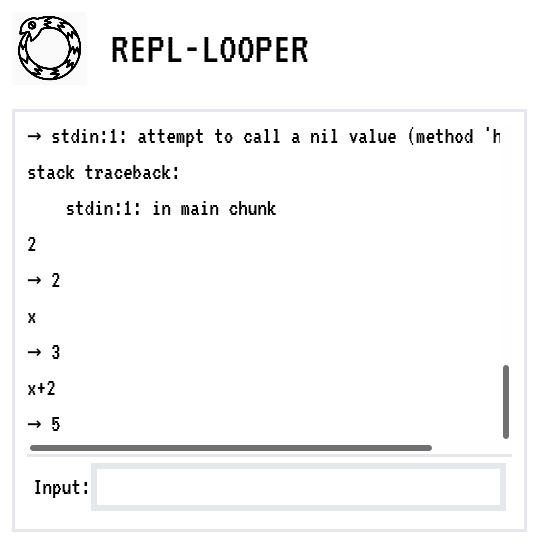
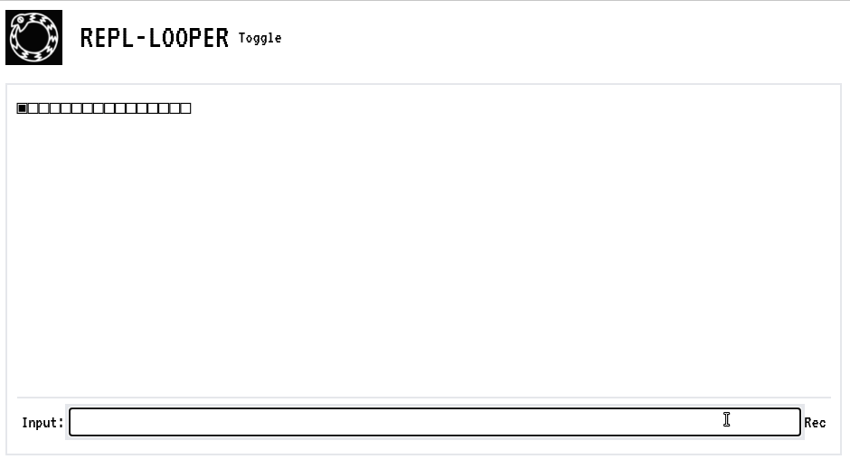
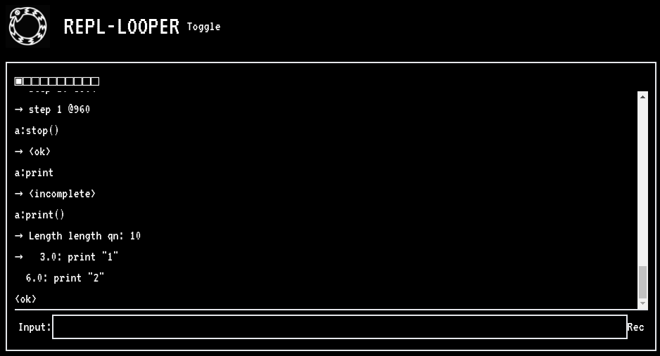
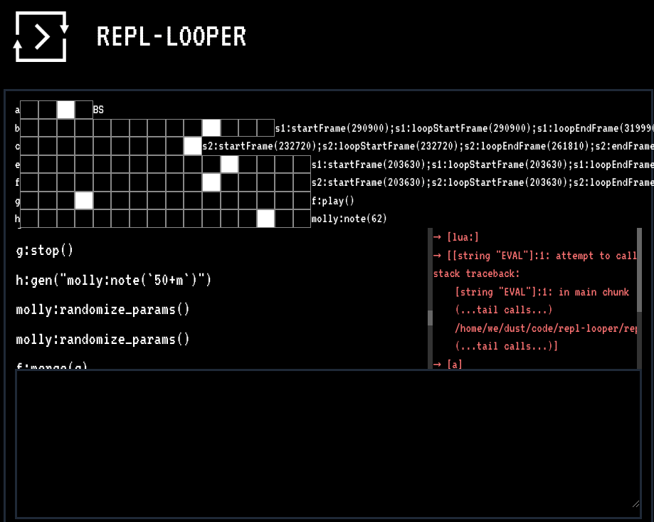

# REPL-LOOPER Development/Experiment Journal

* 2021-09-19 
  * Sketched out basic idea last night
  * Have some diagrams in my notebook too
  * Can send/receive REPL commands via websockets
  * Next need to get (probably quantized) recording going
  * Idea is to maybe use Lattice, so I guess one pattern per event
  * Once a loop is recorded, make that a variable on the host itself (even though it was recorded on the client kinda)
* 2021-10-02
  * Messing with [websocketd](https://github.com/joewalnes/websocketd) for testing
  * Running `websocketd --port 5555 sh -c 'lua -i 2>&1'`
* 2021-10-09 
  * Got some basic recording working in UI
  * Setting this up to start building the norns-lua side in the same repo
  * Just came up with a clever double-JSON-encoding to send loops client->server
  * I probably shouldn't be so pleased with myself
  * I got loops sending AND turned into lattice patterns!
  * A fun part of that was using negative time offsets for the pattern starts
  * I'm moving this toward assuming an overall 16-step sequence, but not necessarily quantized yet
  * Next some UX improvements; command history is definitely one
  * Sweet ... got it adjusted to play back on the first loop
  * Used [peek](https://github.com/phw/peek) to record this cool gif
* 2021-10-10
  * Last night I dreamed about loops playing loops. Good.
  * Made loops variable length (quantize later!)
  * Run `nodemon --exec ./util/sync.sh -w repl-looper.lua` to auto eval server code
  * Re-worked a bunch of calculations and gave them better labels
  * Next up is getting to record multiple loops, and then sync between them!
* 2021-10-11
  * Show the current loop position on The Grid!
  * Turn the lua Loop into an actual object, reorganize
  * Maybe instead of `loops[1]` I should flatten it to `l1`. Kinda evil but I kinda like it. We'll see
  * OK... while doing that I was looking at maybe using single-letter vars. Well I went through looking at their values one by one and typed in `q` and apparently that shuts down norns. Sooo I guess don't use that one
  * Now going to use 'a'..'h' for shortcuts (avoid 'q'!)
* 2021-10-15 
  * Refactored loop a bit so the lattice+patterns can be updated
  * Built a quantizer (in-place for now)
  * The idea is to start building some loop inspection and modification tools. Then we could loop over loops and do things to them on each loop
  * Also inversed the colors some, we'll see how I like that as we go. I mean... it's gotta LOOK cool too, right?
  * Also made a script to hold the watch+sync command so I don't have to remember it
* 2021-10-16
  * If we have a fixed-length loop when recording, then we should play back the loop events already recorded when we loop around. Right now the loop isn't sent to the norns until the end when it is fully formed. Tricky.
  * Another recording mode should be that you select the step and THEN record the event, like a step sequencer instead of a loop recorder
  * A similar record mode would be you have one event and then you place it at different steps of different loops! Even MORE like a sequencer. snare kick snare kick
  * Got visualizing a loop+events working on the grid
* 2021-10-23
  * Couple things over the week -- one big one is that now you can grid button press to manually trigger events! This worked WAY better than I expected. I think because the engine is non-blocking, with simple note playing it is very responsive and you can play multiple notes at once and all that
  * Also doing the `load` right on a string all the time seems fine so far. If need be I can cache the resulting function later
  * I've now moved the loop-recording over to lua, which should let us go a bit meta (triggering recording/playback from within a recording loop, for example)
  * Got more than one loop recording and playback! And made cool single-letter shortcuts. So you start right off with a..h (8 loops) ready to go
  * Hmm. If I'm playing back a loop and recording a loop at the same time ... I think right now it'll record the playback. Feedback loop. Probably a cool mode, but would be a weird default
  * OK, I made a new loop flag called `record_feedback` that decides what to do there, default false. Manually triggered events look the same as hand-typed ones currently
* 2021-10-24
  * Added basic sequence editing. Now you can go into sequence-edit mode, select a step, and then when you press other buttons it will toggle those commands at those buttons -- basically paste or delete
  * Kinda neat, but it does ALL the commands -- so it copies/pastes/erases them all. Not sure how to make it more granular, but it could at least not erase other commands
  * New mantra elaborating on Mrs Denton's wise words:
    * Loops Are Fun!
    * Globals Are Evil!
    * => Loopy Globals Are Evil Fun!
  * One of these days I need to work on the "music" bit haha
* 2021-11-18
  * I've added SO MANY THINGS since the last update!
  * Tonight I added tab-completion!!!
  * Let's see.... what else have I added ....
  * History, playing samples, Timber, a piano shortcut, cross-loop recording
  * I've started to practice being musical with Timber, I made this cool super low-frequencing slow throbbing sound that I call Dragon's Breath. But I don't remember how
  * I'm wrapping some OOP around Timber samples and voices
* 2021-11-30
  * Tab completion is so great
  * Got fixed-length playback-during-record working
  * I'm starting to get familiar with Timber's filters, though there are a few that I don't know how to work yet. I added reverse() shortcuts
  * I got a bunch of 808 samples wired in!
  * A really simple thing -- if you run a command and then press 'enter' again it will re-send the same command. Really nice for laying down a beat or making some incremental change!
* 2021-12-05
  * Improved event recording timing. One weird thing is that if auto-quantize is turned on and you record (and thus trigger) an event but it gets rounded to the future then it'll play again. I turned auto-quantize off for now
  * Started creating some generators. First is `gen` which does some string-lambda work to let you fill out all 16 steps with a parameterized event
  * The the event log is flooding the UI and causing it to get behind after a while. I'm not sure which end is buffering, I kinda think it is the Norns side, but I'm not sure. I will likely disable event-history-log output
  * I'm starting to work out some performance plans and basic structure. Like I'll probably leave auto-quantize off, but use `gen` to fill in some drums that will act as a metronome. Also filling a row with different notes and then using the grid to play those while recording the commands to another loop is working great!
  * One thing that is weird is that the loop doesn't really own the samples, so stopping the loop doesn't necessarily stop the samples. But I think that's probably good overall
* 2021-12-12
  * Been working on the generator some. Turns out most of the macros were really about spreading beats, so I added explicit params for that
  * Tuned up the UI a bit. Some colors, but also show the loop-letters and a recent command for each
  * Been practicing different techniques almost nightly. I renamed the piano sample to ... `piano` ... so that when I'm then doing weird things to it the audience will be able to follow at least a little. I take the piano and reverse and bit crunch it into a cool thing
  * Tonight I forked Timber so that I could configure how log of a sample it would allow. Then I combined that with the generator to make a slicer across a row!
  * Been thinking about merging MollyThePolly engine into this one as a big super-engine so that I can do more than weird things to the piano sample. I started doing research on how to do thus but I'm not sure if I'll go for it or not
  * Added clone and merge for loops. Even weirder I added `split` for loops. This does text edit distance to group all of the event-commands into two groups and then moves one group onto another row. That way if you find that you had put too much stuff onto one loop you can automatically break it into to separate loops. I think there is going to be some timing issues, since each loop has it's own clock ... though that could be fixed through a reset() and start() on both at the same time or something like that
  * Another visual thing is the UI lua-pretty-printer now tries to put more on a single line, making looking at loop contents much nicer
* 2021-12-24
  * I updated the techniques.lua file and organized it a bit, might record a corresponding video tutorial
  * It's not committed due to size, but I pulled down more Library of Congress samples to play with and have been practicing slicing and re-sequencing these samples
  * Just under a week to go before my flashcrash.net performance! I'm in AZ visiting family, dragged what is hopefully all of the essential parts of my streaming setup here and need to find a spot to practice and perform. I did one practice stream to twitch, but need to do a few more
  * I got Molly The Polly embedded! I think this'll be a good way to get some drone or bassline in there, need to practice it more. Mostly I've been randomizing the praameters until it sounds nice, but I then need to probaby sequence some of the parameters
  * In general one of the biggest thing I am working on is the dynamics -- parts coming in and out, fading, etc
* 2021-12-27 
  * Getting ready for flashcrash.net!
  * I found some good samples from [Library of Congress Citizen DJ Project](https://citizen-dj.labs.loc.gov/), along with some slicing shortcuts
* 2022-01-01
  * Had fun at FlashCrash!
  * I think some of my practice runs were a bit better _musically_ speaking :)
  * What's next? I signed up for next month :)
* 2022-01-11
  * Making good progress on controlling dynamics better. I'm teaching all of the sub-engines how to route their output into per-loop tracks with independent volume control. I'll be able to add other things to those as well, like reverb and compression and whatnot. I got Timber and Goldeneye, need to get Molly The Poly as well -- but for those other two you can now do like `c:amp(0.5)` and every event generated on loop-c will pass through a 0.5 amp (half volume)
  * Worked out how to use musicutil+sequins to pretty easily generate a playable row in a certain key
  * I likely won't have time before flashcrash, but another idea is bringing in some live microphone recording of vocals or instruments like a normal boring looper BUT of course these could be samples which get sliced and so on easily
* 2022-01-17
  * I was further off than I thought for per-loop setup, but I got it sorted. I had to do a bunch more work to allow having multiple ACTUALLY independent instances of Molly, but I got it going
  * Immediately I also got a fade-in/out going, so you can do `a:amp(0, 10)` to fade-out
  * Came up with a cool multi-object wrapper so you can do `ALL{a,b,c}:amp(0, 10)` to fade out three loops at once. Also you can chain methods like `ALL{a,b,c}:play(1):amp(1,10)`. If you have a list of things you can do them all, `ALL(loops):amp(0, 10)` to fade all loops for example!
  * This fading in and out is working out really well
  * Also added `a:put(16, "ALL{a,b}:amp(0, 10)")` to make it easy to create control-buttons. Like you could have triggers that fade out the drums, fade them in, start them over, etc
  * Recorded a video walk-through of techniques and now updating docs. Realized that Molly and Timber are GPL so I switched over the license on REPL-LOOPER to match
* 2022-01-22
  * It ... is very difficult to resist adding more features
  * Yesterday/today added: new note-off `gen` mode, stop-after-loop mode, timber-slicing
  * Another idea I've been thinking of is that sometimes I end up with a bunch of 8-step loops and it starts feeling constrained on the left side of the grid. So could make like `a2..h2` loops that are always 8 steps (visually) and hang out on the right side of the grid
  * With timber slicing again I also added reverse-loops
  * Timber still loads down a surprising amount of CPU, I'm still thinking it is something that I messed up because other users of the upstream Timber seem to not have issues. Or maybe it is the way I'm doing slicing. Not sure
* 2022-04-17
  * I got the midi foot-switch working! (slight hack of norns C code)
  * Copying from thirtythree, I got simple audio recording
  * So now! It's an actual looper! Button 1 of the peddal starts/stops, button 2/3 change which loop you are recording into.
* 2022-04-25
  * Now I'm exploring an all-norns workflow. I've gotten keyboard input going and a log of commands on the screen. History up/down and tab completion too!
